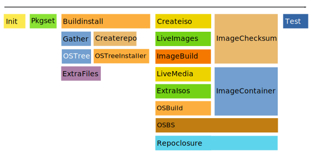

.. _phases:

Phases
======

Each invocation of ``pungi-koji`` consists of a set of phases.

Most of the phases run sequentially (left-to-right in the diagram), but there
are use cases where multiple phases run in parallel. This happens for phases
whose main point is to wait for a Koji task to finish.

Init
----

The first phase to ever run. Can not be skipped. It prepares the comps files
for variants (by filtering out groups and packages that should not be there).
See :doc:`comps` for details about how this is done.

Pkgset
------

This phase loads a set of packages that should be composed. It has two separate
results: it prepares repos with packages in ``work/`` directory (one per arch)
for further processing, and it returns a data structure with mapping of
packages to architectures.

Buildinstall
------------

Spawns a bunch of threads, each of which runs either ``lorax`` or
``buildinstall`` command (the latter coming from ``anaconda`` package). The
commands create ``boot.iso`` and other boot configuration files. The image is
finally linked into the ``compose/`` directory as netinstall media.

The created images are also needed for creating live media or other images in
later phases.

With ``lorax`` this phase runs one task per variant.arch combination. For
``buildinstall`` command there is only one task per architecture and
``product.img`` should be used to customize the results.

Gather
------

This phase uses data collected by ``pkgset`` phase and figures out what
packages should be in each variant. The basic mapping can come from comps file,
a JSON mapping or ``additional_packages`` config option. This inputs can then
be enriched by adding all dependencies. See :doc:`gathering` for details.

Once the mapping is finalized, the packages are linked to appropriate places
and the ``rpms.json`` manifest is created.

ExtraFiles
----------

This phase collects extra files from the configuration and copies them to the
compose directory. The files are described by a JSON file in the compose
subtree where the files are copied. This metadata is meant to be distributed
with the data (on ISO images).

Createrepo
----------

This phase creates RPM repositories for each variant.arch tree. It is actually
reading the ``rpms.json`` manifest to figure out which packages should be
included.

OSTree
------

Updates an ostree repository with a new commit with packages from the compose.
The repository lives outside of the compose and is updated immediately. If the
compose fails in a later stage, the commit will not be reverted.

Implementation wise, this phase runs ``rpm-ostree`` command in Koji runroot (to
allow running on different arches).

Createiso
---------

Generates ISO files and accumulates enough metadata to be able to create
``image.json`` manifest. The file is however not created in this phase, instead
it is dumped in the ``pungi-koji`` script itself.

The files include a repository with all RPMs from the variant. There will be
multiple images if the packages do not fit on a single image.

The image will be bootable if ``buildinstall`` phase is enabled and the
packages fit on a single image.

There can also be images with source repositories. These are never bootable.

ExtraIsos
---------

This phase is very similar to ``createiso``, except it combines content from
multiple variants onto a single image. Packages, repodata and extra files from
each configured variant are put into a subdirectory. Additional extra files can
be put into top level of the image. The image will be bootable if the main
variant is bootable.

LiveImages, LiveMedia
---------------------

Creates media in Koji with ``koji spin-livecd``, ``koji spin-appliance`` or
``koji spin-livemedia`` command. When the media are finished, the images are
copied into the ``compose/`` directory and metadata for images is updated.

ImageBuild
----------

This phase wraps up ``koji image-build``. It also updates the metadata
ultimately responsible for ``images.json`` manifest.

OSBuild
-------

Similarly to image build, this phases creates a koji `osbuild` task. In the
background it uses OSBuild Composer to create images.

OSBS
----

This phase builds container base images in `OSBS
<http://osbs.readthedocs.io/en/latest/index.html>`_.

The finished images are available in registry provided by OSBS, but not
downloaded directly into the compose. The is metadata about the created image
in ``compose/metadata/osbs.json``.

ImageContainer
--------------

This phase builds a container image in OSBS, and stores the metadata in the
same file as OSBS phase. The container produced here wraps a different image,
created it ImageBuild or OSBuild phase. It can be useful to deliver a VM image
to containerized environments.

OSTreeInstaller
---------------

Creates bootable media that carry an ostree repository as a payload. These
images are created by running ``lorax`` with special templates. Again it runs
in Koji runroot.

Repoclosure
-----------

Run ``repoclosure`` on each repository. By default errors are only reported
in the log, the compose will still be considered a success. The actual error
has to be looked up in the compose logs directory. Configuration allows customizing this.

ImageChecksum
-------------

Responsible for generating checksums for the images. The checksums are stored
in image manifest as well as files on disk. The list of images to be processed
is obtained from the image manifest. This way all images will get the same
checksums irrespective of the phase that created them.

Test
----

This phase is supposed to run some sanity checks on the finished compose.

The only test is to check all images listed the metadata and verify that they
look sane. For ISO files headers are checked to verify the format is correct,
and for bootable media a check is run to verify they have properties that allow
booting.
