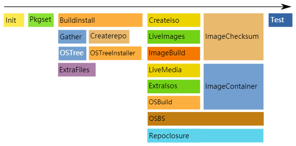

# pungi

```
Something I hope you know before go into the coding~
First, please watch or star this repo, I'll be more happy if you follow me.
Bug report, questions and discussion are welcome, you can post an issue or pull a request.
```


Pungi is a distribution compose tool.

Composes are release snapshots that contain release deliverables such as:

* installation trees
  - RPMs
  - repodata
  - comps
* (bootable) ISOs
* kickstart trees
  - anaconda images
  - images for PXE boot

```
The name Pungi comes from the instrument used to charm snakes. Anaconda being the software Pungi was manipulating, and anaconda being a snake, led to the referential naming.

The first name, which was suggested by Seth Vidal, was FIST, Fedora Installation <Something> Tool.
That name was quickly discarded and replaced with Pungi.

There was also a bit of an inside joke that when said aloud, it could sound like punji, which is a sharpened stick at the bottom of a trap. Kind of like software…
```


## 相关站点

* 官方源码：<https://pagure.io/pungi>
* 官方文档：<https://docs.pagure.org/pungi/>


## 目录


* [pungi介绍](docs/pungi介绍.md)
* [pungi容器化部署](docs/pungi容器化部署.md)
    * [pungi容器化部署-rocky8.6](docs/pungi容器化部署-rocky8.6.md)
    * [pungi容器化部署-fedora36](docs/pungi容器化部署-fedora36.md)
* [pungi源码分析](docs/pungi源码分析.md)


## 图示




---
