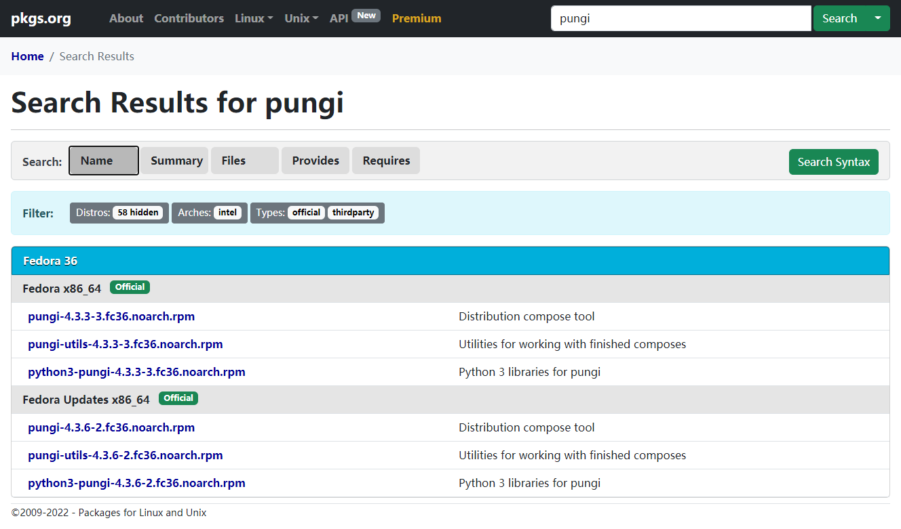
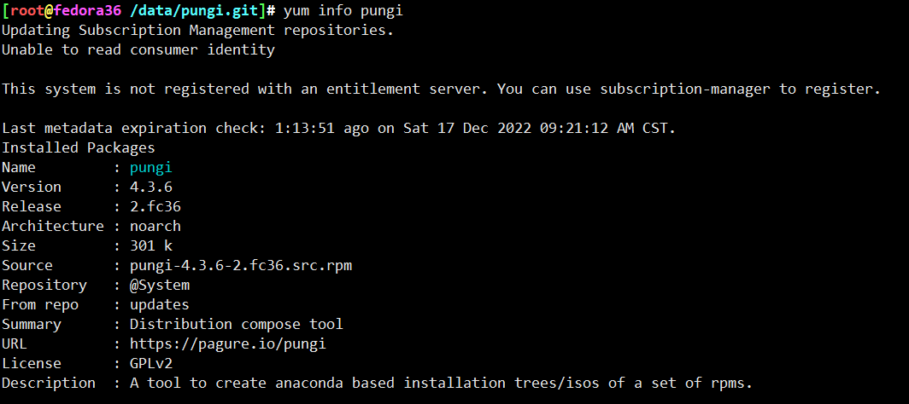
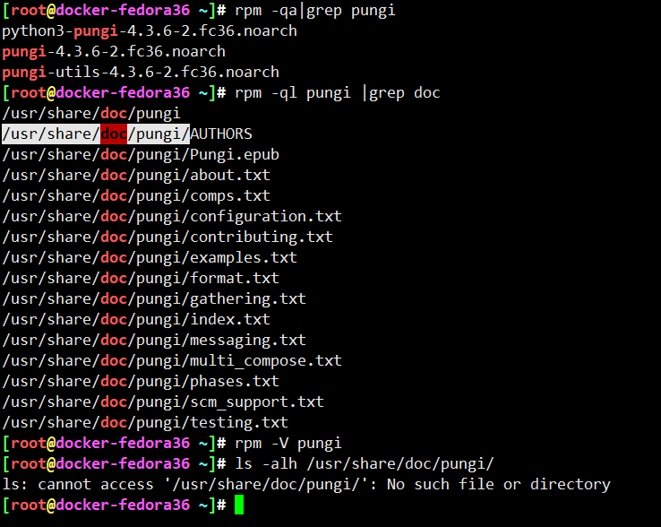
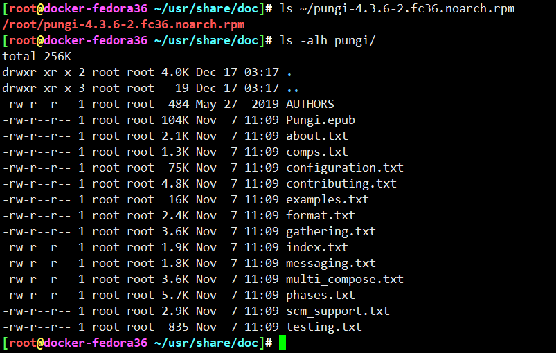
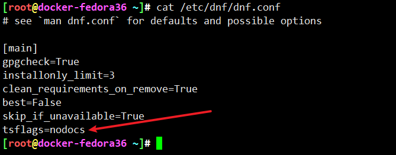
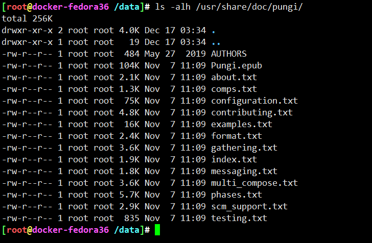

# pungi容器化部署-fedora36


## 版本选定





择取2022年12月17日，fedora36最新版本**pungi-4.3.6-2.fc36.src.rpm**


## 容器中为何找不到doc？



容器中，pungi包对应的doc为何没有，但是包校验又都是正常？



但是直接拆解又能看到doc相关内容


<https://man7.org/linux/man-pages/man8/rpm.8.html>
rpm帮助命令里是有忽略文档的选项

```
       --excludedocs
              Don't install any files which are marked as documentation
              (which includes man pages and texinfo documents).
```




* <https://bugzilla.redhat.com/show_bug.cgi?id=966715> 找到了，因为dnf.conf中有一个标准为，忽略docs



删除配置，重新安装，文件就有了


---
