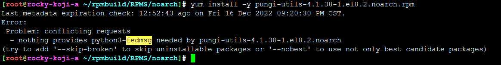
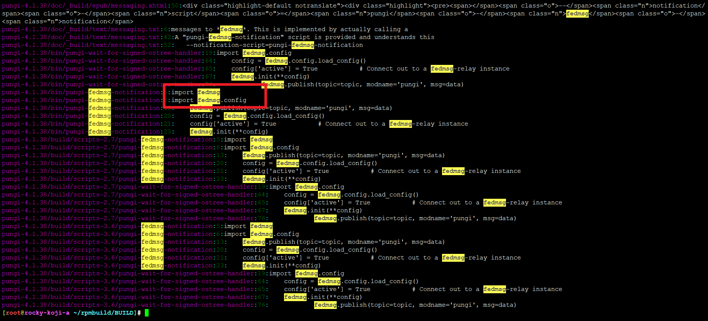
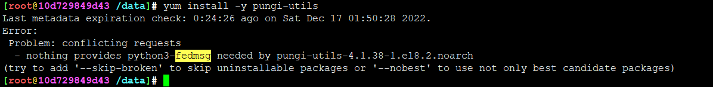
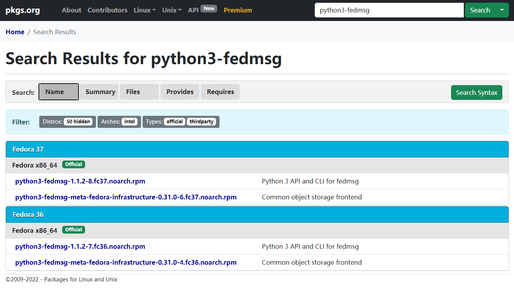
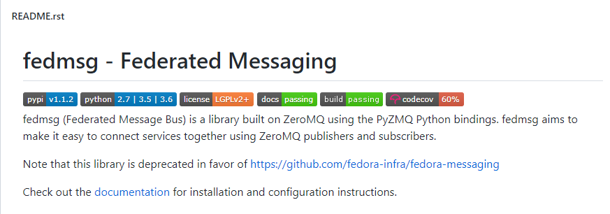
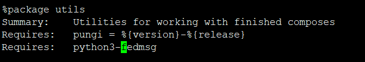

# pungi容器化部署-rocky8.6


## rocky8.6 pungi 依赖 python3-fedmsg





pungi-utils 一些组件是需要 fedmsg ，但是rocky并没有提供






fedmsg 是什么？

```
fedmsg (Federated Message Bus) is a library built on ZeroMQ using the PyZMQ Python bindings. fedmsg aims to make it easy to connect services together using ZeroMQ publishers and subscribers.
```




* <https://github.com/fedora-infra/fedmsg>




rocky的软件适配还有待加强，基础设施还不够完善，期待改进~~

说实在的，rocky现在还不够open，gitlab账号注册都麻烦，基本就是几个老外圈子里玩，小小围城，谈何自由？ 早日开放吧，这是趋势...


---
